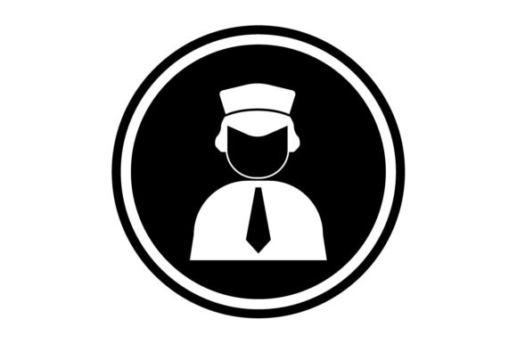

# Co-Pilot [](https://github.com/sindresorhus/awesome)
=======

This project has been developed in July 2019 during the [Yuuvis Hackathon in San Francisco] (https://yuuvishacksanfrancisco-platform.bemyapp.com/#/event) organized by Yuuvis and Bemyapp with the following Sponsors that we thank you so much for the great resource they were able to provide. 
[Presentation](https://docs.google.com/presentation/d/e/2PACX-1vSQrr-x2NHpnR4NbWxdfWfRsSzEI1edJEWXURU3Dcdk4QclXITcpPtY7lMHYptcmrXLRT18oWjUceQv/pub?start=false&loop=false&delayms=3000&slide=id.g52191f22dd_1_12)


## Authors

* **Alberto Tono** - *San Francisco Computational Design Institute* - [SFCDI](https://www.sfcdi.org)
* **Raiz Munshi** - *Yahoo* - [Yahoo](https://www.yahoo.com)
* **Unicorn ** - *UsData* 

We participate on the *Search and Collaboration* challenge: 

* New Hire orientation and navigation
* Improving Search for new employee with Fuzzy Matching
* Undermine the limitation of the Cybersecurity in a Enterprise company

Presentation: 
https://docs.google.com/presentation/d/1uL1N66qP9okW5KsW7J7cxcwzE3m1eett8EwkJiCczc4/edit?usp=sharing


We developed a BOT called Co-Pilot that allow new hire or people who don't have access to information to send an anonimous request to the owner of those Information in order to provide this information to the new employee. They will have a co-pilot that can help them navigate company resource without affect the privacy.

## Getting Started

These instructions will get you a copy of the project up and running on your local machine for development and testing purposes. See deployment for notes on how to deploy the project on a live system.

### Prerequisites

Javascript, 
API Key from Yuuvis 
Azure SQL 
Schema

```
<schema xmlns="http://optimal-systems.org/ns/dmscloud/schema/v4.0/" 
        xmlns:xsi="http://www.w3.org/2001/XMLSchema-instance" 
        xsi:schemaLocation="http://optimal-systems.org/ns/dmscloud/schema/v4.0/ dmsCloud-schema.xsd">
        <propertyStringDefinition>
            <id>from</id>
            <propertyType>string</propertyType>
            <cardinality>single</cardinality>
            <required>true</required>
        </propertyStringDefinition>
        <propertyStringDefinition>
            <id>to</id>
            <propertyType>string</propertyType>
            <cardinality>multi</cardinality>
            <required>true</required>
        </propertyStringDefinition>
		<propertyStringDefinition>
            <id>subject</id>
            <propertyType>string</propertyType>
            <cardinality>single</cardinality>
            <required>true</required>
        	<defaultValue>hello</defaultValue>
        	<maxLength>20</maxLength>
	        <minLength>4</minLength>
		</propertyStringDefinition>
		<propertyDateTimeDefinition>
            <id>received</id>
            <propertyType>datetime</propertyType>
            <cardinality>single</cardinality>
            <required>true</required>
        </propertyDateTimeDefinition>
		<typeDocumentDefinition>
            <id>email</id>
            <baseId>enaio:document</baseId>
            <propertyReference>from</propertyReference>
            <propertyReference>to</propertyReference>
            <propertyReference>received</propertyReference>
			<contentStreamAllowed>required</contentStreamAllowed>
        </typeDocumentDefinition>
</schema>
```

# Architecture


